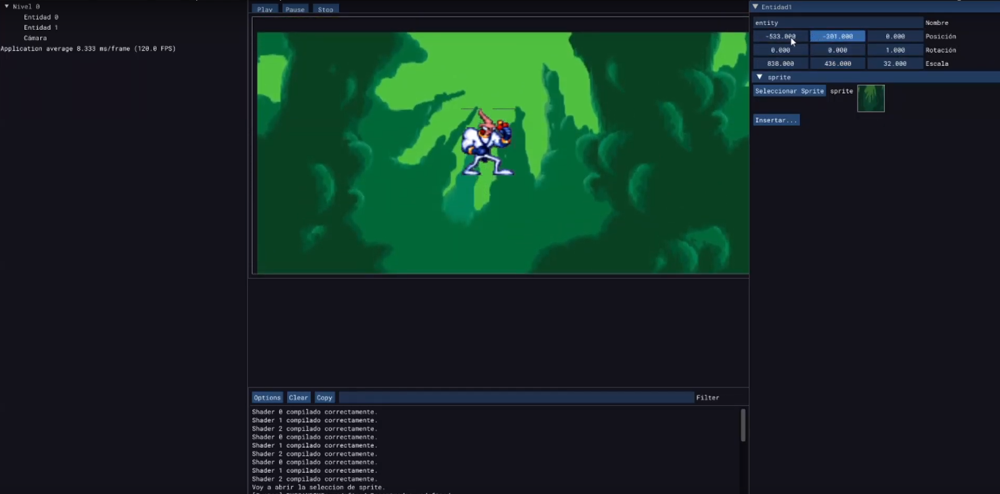
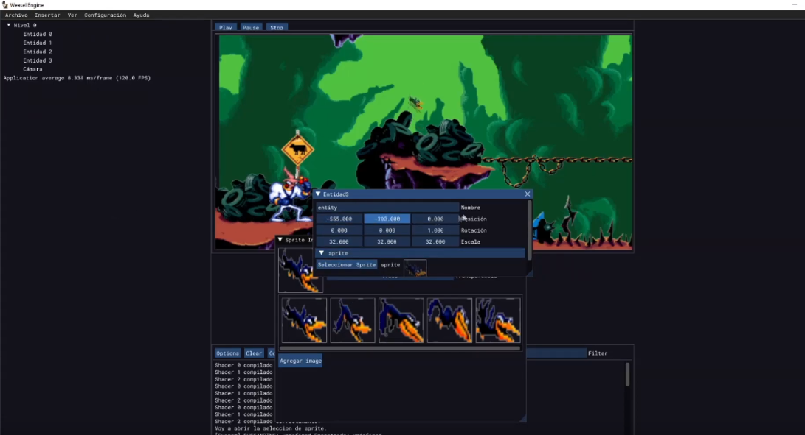
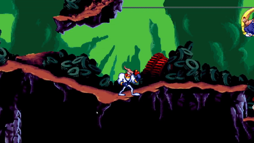

# Weasel-Game-Engine
**Final project of Computer Engineering degree**  

**Requirements:**
- Have installed make or a similar tool.
- Have installed OpenGL (latest version desirable).

**How to run:**  
Use the command make and then main (WINDOWS)

**Used libraries:**
- GLFW3
- Glew
- stbImage
- Dear ImGui
- LUA
- irrKlang

**A quick introduction**

Weasel Engine is a 2D engine I created as final project for getting my Computer Engineer degree in 2021. The objective for this project was to implement the engine and show that it can be used in the development of 2D games with certain facility. The engine provides tools like world editing, scripting (with LUA), collision detection, camera controls, music player, support for different shaders (predefined), sprite animations and a particle system (that's not so easy to use). It also has some tools to save and load projects and obviously be able to execute the project in debug mode, aswell as in "prod" mode.

To show that it can be used for development I recreated the first level of Earthworm Jim, taking some degrees of freedom regarding the location of some bosses and making it shorter just for demo purposes. The bosses are also simpler than in the original version, again, just because of the time dedicated to the demo implementation.

I presented this on March 30 2021 and everyone loved it. I'm officially a Computer Engineer now 😃.

**Future work**

I took a time focused in other projects and work, but I'm planning on getting back to this engine and make a better version of it. Expect some new commits in the near future.

List of things in scope:
- Refactoring of current codebase.
- UI improvements (make it better looking, adjust margins and paddings for different resolutions, etc).
- Better collider management.
